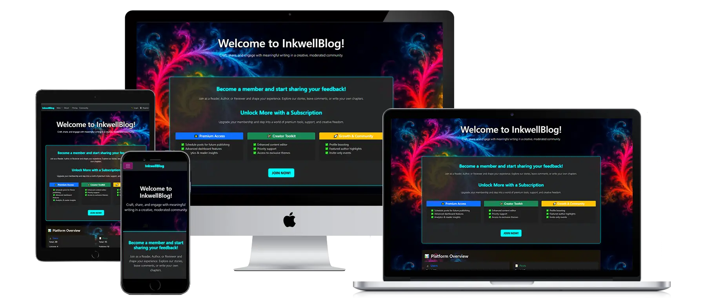
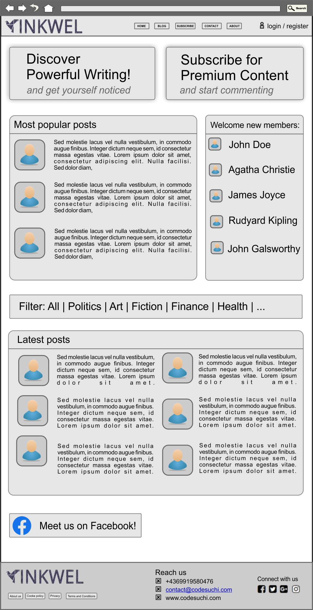
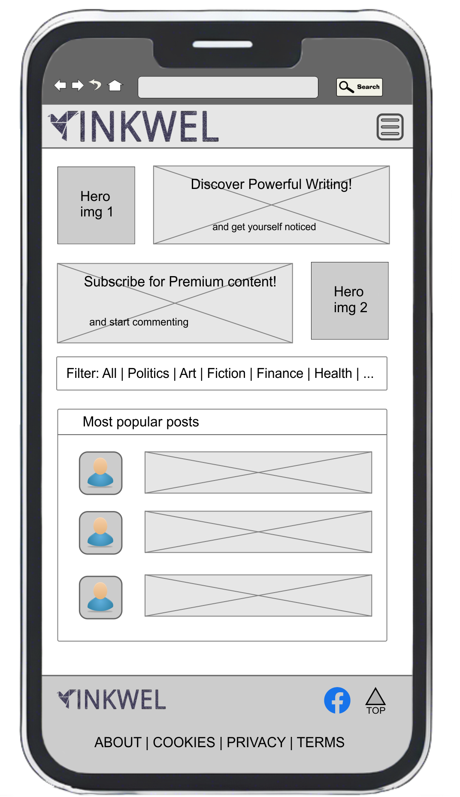
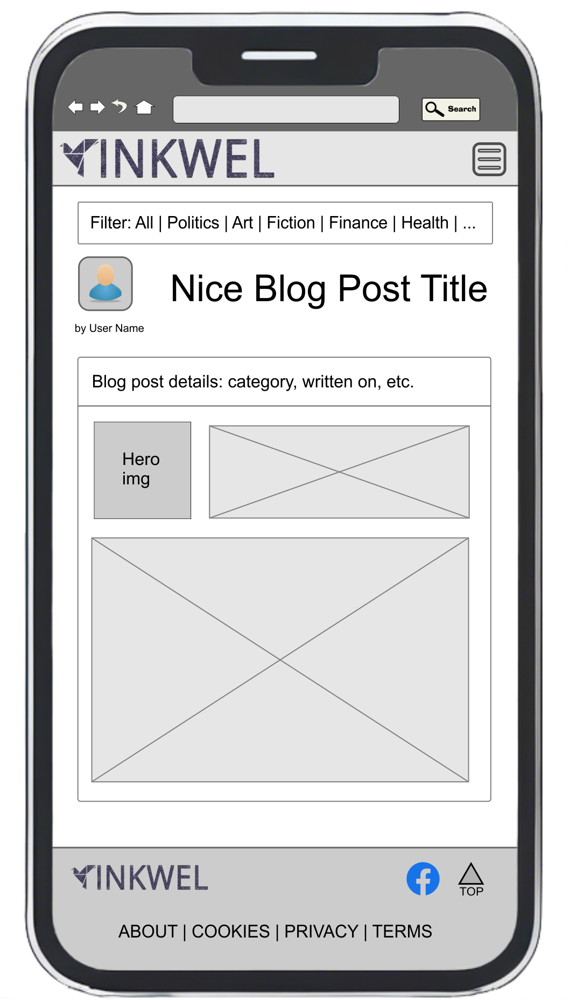
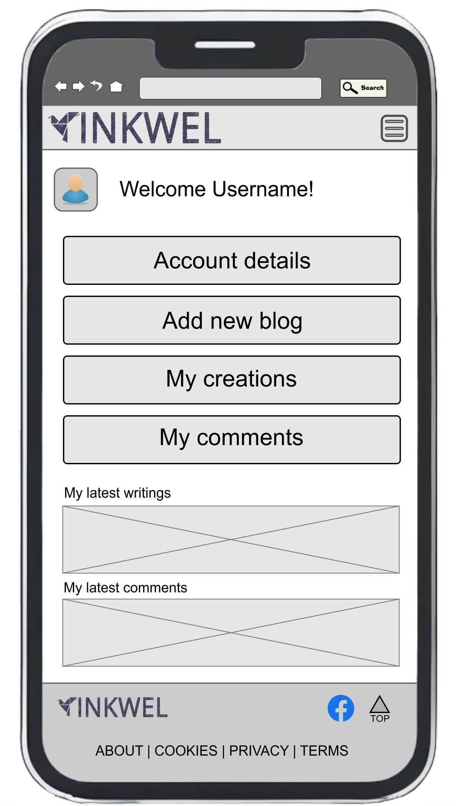
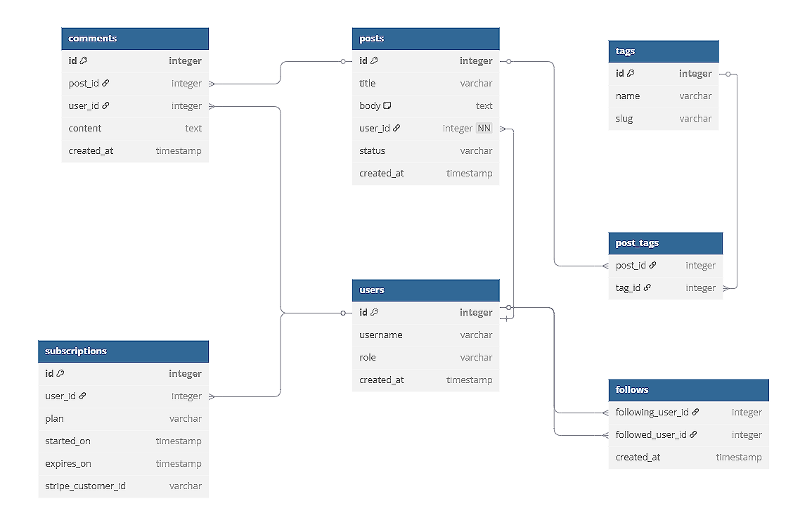

# Portfolio-project-5
Portfolio Project 5 - E-commerce Applications

# 📝 InkWell – A Premium Blogging Platform

**InkWell** is a full-stack blogging platform that allows authors to publish both public and subscriber-only posts. It includes e-commerce integration for subscriptions, secure role-based authentication, SEO features, and a clean, accessible UI.



## Table of Contents

* [Overview](#overview)
* [Agile Methodology](#agile-methodology)
* [User Experience (UX)](#user-experience-ux)
    * [Strategy / Site Goals](#strategy--site-goals)
    * [Scope / User Stories](#scope--user-stories)
    * [Structure / Design Choices](#structure--design-choices)
    * [Skeleton / Wireframes](#skeleton--wireframes)
    * [Surface](#surface)
* [Features](#features)
    * [Existing Features](#existing-features)
    * [Future Features](#future-features)
Authentication & Authorization  
Product Management  
Cart & Checkout Flow  
Payment Integration  
Order Management  
Media & File Storage  
Session & Security Features  
* [Technologies Used](#technologies-used)
* [Testing](#testing)
* [Bugs](#bugs)
* [Deployment](#deployment)
    * [Forking the GitHub Repository](#forking-the-github-repository)
    * [Creating a Local Clone](#creating-a-local-clone)
* [Credits](#credits)
* [Acknowledgements](#acknowledgements)


## Overview

**InkwellBlog** is a dynamic publishing platform designed for writers, reviewers, and readers to connect through curated content and community-driven storytelling. Whether you're an aspiring author or a passionate reader, the site offers a structured environment to share ideas, publish articles, and engage with thoughtful commentary. The platform supports both free and premium membership tiers, allowing users to explore content at their own pace while unlocking advanced features as they grow.

Premium members gain access to exclusive posts, editorial voting rights, and enhanced tools tailored for content creators and reviewers. Authors can showcase their work with rich formatting and media support, while reviewers contribute to the quality and visibility of published pieces. The platform also features a newsletter system that delivers curated updates, behind-the-scenes insights, and community highlights directly to subscribers.

With a clean interface, role-based access, and a growing library of published content, InkwellBlog fosters a collaborative space for creative minds. Whether you're browsing the latest posts, contributing your own, or upgrading to premium for deeper engagement, the site is built to support meaningful interaction and elevate the writing experience.

[Back To Top](#table-of-contents)

## Agile Methodology

This project was developed following the principles of Agile Methodology, with GitHub Issues serving as the central hub for tracking User Stories. Each story was carefully structured with Acceptance Criteria and associated Tasks, though some of these evolved during implementation as the technical requirements became clearer. Several related User Stories were later grouped into Epics to better reflect their interconnected nature. While some tasks were completed more quickly than expected, others required significantly more time and iteration. For better grouping and time-wise management User Stories where assigned to 6 Milestones (see screenshots below). A GitHub project "InnkwellBlog project" was created at the same time. GitHub project allowes using its Board views with filtering and grouping options.

<details>
<summary>Screenshots of Kanban Board, Milestones and project board view</summary>


</details>

To prioritize development effectively, I applied the MoSCoW Method — categorizing each User Story as a 'Must Have', 'Should Have', 'Could Have', or 'Won’t Have'. Only the essential stories needed to achieve a Minimum Viable Product (MVP) were implemented in this phase, with lower-priority items deferred to the backlog for future development.

Visual tools like a Kanban board and issue tracking screenshots helped streamline progress and maintain clarity throughout the build. Overall, adopting Agile practices greatly improved my ability to organize, adapt, and manage time efficiently.

--------------------------------------------------------------------
## Testing

📝 Testing Strategy Justification

In the context of this project, I have chosen to focus on thorough manual testing rather than implementing automated testing. This decision is based on a careful evaluation of the project’s scope, complexity, and resource constraints.

✅ Project Scope & Nature

The application is relatively lightweight, with a clear and well-defined set of user interactions — such as viewing newsletters, navigating static pages, and submitting simple forms. These flows are straightforward to test manually and do not involve complex logic, high-volume data processing, or frequent regression scenarios that would typically justify automation.

✅ Efficiency & Resource Allocation

Setting up automated testing — including writing test cases, configuring test runners, and integrating CI pipelines — would require a significant investment of time and effort. Given the limited scale of the project, this would not yield proportional benefits. Instead, I’ve directed those resources toward refining the user experience, improving content quality, and ensuring mobile responsiveness — areas that offer more tangible value to users and reviewers.

✅ Manual Testing Coverage

I’ve implemented a structured manual testing routine that covers:
  • Core functionality across all major pages
  • Mobile responsiveness and layout integrity
  • Content accuracy and dynamic rendering
  • SEO and accessibility essentials
  • Edge cases such as broken links, form validation, and navigation behavior
  • Code Validation
  • Lighthouse
  • Browser Compatibility
  • User Stories
  
This routine is documented and repeatable, ensuring consistent quality checks after each deployment and update.

✅ Future Considerations

Should the project evolve into a larger platform with more dynamic features, user-generated content, or frequent updates, I would absolutely revisit the testing strategy and introduce automation where it becomes beneficial. For now, however, manual testing offers the best balance of coverage, efficiency, and maintainability.
By tailoring the testing approach to the actual needs of the project, I’ve ensured that time and effort are spent where they matter most — delivering a polished, functional, and user-friendly application.

🧭 Manual Testing Scope: What to Cover

Here’s a breakdown of areas that were tested manually, grouped by priority:

🔹 Core Functionality

  • ✅ Homepage loads correctly
  • ✅ Navigation menu works across screen sizes
  • ✅ Newsletter cards link to correct detail views
  • ✅ Forms (contact, signup, etc.) submit and validate properly
  • ✅ Sitemap.xml is accessible from the menu

🔹 Content Accuracy

  • ✅ Newsletter titles, dates, and previews display correctly
  • ✅ Truncated content doesn’t show images (as intended)
  • ✅ Static pages (About, Privacy, etc.) render expected content

🔹 Mobile Responsiveness

  • ✅ Navbar collapses and expands correctly
  • ✅ Buttons and links are tappable without overlap
  • ✅ Font sizes and layout adapt to small screens

🔹 Visual Consistency

  • ✅ Buttons have correct styling (e.g. newsletter “View” button)
  • ✅ Headings and spacing look clean across pages
  • ✅ No broken images or layout shifts

🔹 Code Validation with W3C Validator 

  • ✅ Start page validation: Document checking completed. No errors or warnings to show.

  
  • ❌ Errors related to Summernote WISIWIG text editor:
  
  ⚠️ HTML Validation Notes
  During development, the project was tested using the W3C HTML Validator to ensure semantic correctness and structural integrity. While most validation issues were addressed, a few remaining errors are directly related to the integration of third-party components — specifically the Summernote WYSIWYG editor used in the comment form.
  ❌ Known Validation Issues
    • Use of non-standard attributes such as summernote="{...}" on <textarea> elements
    • Improper use of hidden="true" instead of the boolean hidden attribute
    • Injection of <style> and <script> tags inside <p> elements, violating HTML content model rules
  These issues are not introduced by custom code, but are generated by Summernote’s rendering engine. Modifying or overriding this behavior would require deep customization of the widget’s internals, which is outside the scope of this project and could compromise stability or future compatibility.
  ✅ Justification
    • The Summernote editor functions correctly across modern browsers and does not impact user experience or accessibility.
    • The errors do not affect layout, responsiveness, or form submission.
    • Attempting to "fix" these errors would involve rewriting third-party logic, which is impractical and unnecessary for this project’s goals.
  🧠 Developer’s Note
  All custom HTML and Django templates have been validated and corrected where possible. Remaining issues are acknowledged and documented here for transparency. Should the project evolve into a production-grade platform, alternative editors or deeper integration strategies may be considered to achieve full compliance.

🔹 SEO & Accessibility

  • ✅ Meta tags are present (viewport, description, etc.)
  • ✅ Sitemap.xml is reachable and correctly formatted
  • ✅ Alt text on images (if any)
  • ✅ Keyboard navigation works

<details>
<summary>Screenshots of testing results.</summary>
<br>

**Startpage**


**About page**


**Cookies page**


**Privacy page**


**Contact form**


**Blog start page**


**Pricing page**


**Community page**


**Premium benefits**


</details>

temp:
-----------------------------------------------------------------------------------------------
## How to View the Project
- [View the deployed website on Heroku](https://inkwell-blog-8edefa7bcffe.herokuapp.com/)
- [View the website repository on GitHub](https://github.com/AlexeyKopchinskiy/Portfolio-project-5-v2)

## 📖 Project Overview

This platform allows authors to manage and monetize content while providing a premium experience for paid subscribers. The goal is to provide a clean, SEO-optimized, and secure blogging space with real e-commerce functionality.

## Agile Methodology

This project was developed using Agile principles, with GitHub Issues serving as the central hub for tracking User Stories — you can view them [here](https://github.com/AlexeyKopchinskiy/Portfolio-project-5-v2/issues). For better accessibility and organization, all issues were grouped into a dedicated GitHub Project, allowing me to visualize progress and manage priorities more effectively. This project called InkwellBlog project can be found [here](https://github.com/users/AlexeyKopchinskiy/projects/12).

Each User Story was defined with clear Acceptance Criteria and associated Tasks. As the project evolved, I occasionally revised these tasks post-implementation, since the exact steps needed to meet the criteria weren’t always obvious at the outset.

Being my only second project using both Agile and the Django framework, the process was still on a learning curve. Some initially separate User Stories were later grouped into Epics, as their functionality turned out to be closely related. Interestingly, while a few tasks were completed more quickly than expected, others required significantly more time and iteration.

To prioritize effectively, I applied the MoSCoW method — categorizing each User Story as a 'Must Have', 'Should Have', or 'Could Have'. A handful of "Won’t Have" items were intentionally left in the backlog for potential future development. My focus was on crafting just enough stories to reach a solid Minimum Viable Product (MVP). Most of the stories were also labeled as 'Developer stories', 'Site owner stories' or 'Visitor stories'

### 🚀 Agile Workflow

- Agile board managed with GitHub Issues and Milestones  
- User stories split into:
  - Developer stories
  - Site owner stories
  - Visitor stories
- Labels include `Must-Have`, `Should-Have`, and `Could-Have`
- Milestones:
  - Project Setup
  - Auth & Roles
  - E-Commerce
  - Blog Engine
  - UX/UI
  - SEO & Marketing
  - Testing & Deployment

Screenshots of the Kanban board, Epics, and User Stories illustrate this workflow.

Overall, adopting Agile proved invaluable. It gave structure to my development process and helped me manage my time more intentionally — even without fixed-length iterations. And yes, moving tasks from 'To Do' to 'Done' was genuinely satisfying.


## 🎯 Project Purpose & Rationale

This web application was developed to support a multi-role content platform that facilitates publishing, reviewing, and engaging with written content. It is designed with four distinct user roles — **Readers**, **Authors**, **Reviewers**, and **Administrators** — each with tailored access, responsibilities, and interfaces.

The rationale behind the project is grounded in real-world user needs and is shaped by the following user stories and personas:

---

### 👤 Reader

**Persona:** Casual or subscribed users who consume published content and engage through comments.

**Needs:**
- Discover and read the latest published posts.
- View and manage their own comment history.
- Navigate the platform easily across devices.

**Dashboard Features:**
- Recent comments panel.
- Sidebar with latest published posts.
- Mobile-responsive layout for reading on the go.

---

### ✍️ Author

**Persona:** Content creators who write and submit posts or newsletters.

**Needs:**
- Draft and edit posts before submission.
- Track published content and engagement.
- View recent feedback or comments on their work.

**Dashboard Features:**
- Drafts and published newsletters.
- Recent authored posts.
- Comment activity related to their content.

---

### 🕵️ Reviewer

**Persona:** Editorial staff or moderators responsible for content quality control.

**Needs:**
- Access to submitted drafts awaiting review.
- Approve or reject content based on editorial standards.
- Communicate feedback to authors.

**Dashboard Features:**
- Review queue with pending submissions.
- Tools to approve, reject, or request revisions.
- History of reviewed content.

---

### 🛠️ Administrator

**Persona:** Platform managers overseeing user activity, content flow, and system health.

**Needs:**
- Monitor platform-wide activity.
- Manage user roles and permissions.
- Ensure content visibility and operational integrity.

**Dashboard Features:**
- Overview of latest published content.
- Access to all user dashboards and settings.
- System-level controls and analytics.

---

## 🧠 Why This Matters

By clearly defining and implementing role-based access and dashboards, the application ensures that each user interacts with the platform in a way that aligns with their goals. This structure promotes:

- ✅ **Security**: Users only access what they’re authorized to see.
- ✅ **Usability**: Dashboards are tailored to each role’s workflow.
- ✅ **Scalability**: New roles or features can be added without disrupting existing flows.
- ✅ **Maintainability**: Clean separation of concerns across views and templates.

The project demonstrates a thoughtful approach to user-centered design, with each feature grounded in a specific user story. It’s not just a technical build — it’s a solution to real communication and content management needs.


## 👥 User Types & User Stories

### Site Owner
- Manage posts, categories, and publishing schedule
- Track subscribers and view platform analytics
- Receive notifications of new subscriptions and comments

### Visitor / Reader
- Browse and read public blog posts without registration
- Register, log in, and subscribe for premium content
- Like, bookmark, and comment on posts

Check out the full list of [user stories and issues here](#) ← *(you can link to your Issues tab or GitHub project board)*

## ✨ Features

- Stripe-powered subscriptions
- Public and premium post access
- Role-based authentication
- Responsive, accessible UI with dark/light mode
- Bookmarking, commenting, and category filters
- Facebook product page / promotional mockup
- Newsletter signup and SEO features (meta tags, sitemap)
- Functional contact form

### 📮 Contact Form Feature

The application includes a fully functional contact form accessible via /contact/. Visitors can submit their name, email, subject, and message directly through the form.

- Submissions are stored in the database via the custom ContactMessage model.
- Messages are timestamped and can be browsed via the Django admin interface.
- User feedback is provided after successful form submission.
- The form is styled with Bootstrap 5 for responsive and accessible design.
- CSRF protection and validation are included.

**This feature demonstrates:**

- Form handling with validation (LO1.4)
- Creation of a custom Django model (LO1.12)
- Clean code with Bootstrap styling and UX considerations (LO2.1)

## 🛠 Technologies & Software Used

| Purpose            | Tool(s)                       |
|--------------------|-------------------------------|
| Code Development   | Visual Studio Code            |
| Backend Framework  | Django (Python)               |
| Database           | PostgreSQL                    |
| DB modelling       | Dbdiagram.io                  |
| UI Styling         | HTML, CSS, Bootstrap          |
| Design/Mockups     | CorelDraw, Photoshop          |
| Wireframing        | CorelDraw, Photoshop          |
| Deployment         | Heroku (or similar)           |
| Payments           | Stripe API                    |
| Version Control    | Git & GitHub                  |
| Github emoji       | Github emoji markup           |


## 📐 Wireframes & UX Design

- Homepage  
- Post detail & premium prompt  
- Admin dashboard  
- User profile | saved posts  

### Website low-fidelity wireframes

#### 🏠 Homepage (Public View)



#### Mobile Homepage



#### Mobile Blog Post Details



### Mobile Login/register page


### Mobile Member Page



## 🔧 Django Apps

| **App name**    | **Purpose**                                  |
|-----------------|----------------------------------------------|
| blog            | Posts, categories, tags, post detail views   |
| accounts        | Custom user model, login, registration       |
| subscriptions   | Stripe integration, premium access control   |
| core            | Homepage, about, footer, reusable templates  |
| admin_dashboard | Admin-only views for content and analytics   |

## DB Modelling

**dbdiagram.io** is used for DB modelling

### 👦 User model
```
Table users {
  id integer [primary key]
  username varchar
  role varchar
  created_at timestamp
}
```

### 📃 Posts model
```
Table posts {
  id integer [primary key]
  title varchar
  body text [note: 'Content of the post']
  user_id integer [not null]
  status varchar
  created_at timestamp
}
```

### 🐾 Following users
```
Table follows {
  following_user_id integer
  followed_user_id integer
  created_at timestamp
}
```

### 🏷️ tags (many-to-many with posts)
```
Table tags {
  id integer [primary key]
  name varchar
  slug varchar
}

Table post_tags {
  post_id integer [ref: > posts.id]
  tag_id integer [ref: > tags.id]
}
```

### 💬 Comments or discussion
```
Table comments {
  id integer [primary key]
  post_id integer [ref: > posts.id]
  user_id integer [ref: > users.id]
  content text
  created_at timestamp
}
```

### 💼 Premium subscriptions (tied to Stripe IDs)
```
Table subscriptions {
  id integer [primary key]
  user_id integer [ref: > users.id]
  plan varchar
  started_on timestamp
  expires_on timestamp
  stripe_customer_id varchar
}
```

## SQL markdown



## User access rights

| View / action                  |   Groups allowed      |     Description    |
|--------------------------------|-----------------------|--------------------|
| Admin Dashboard (/admin/)      | Admins (via is_staff) | Full access to Django's built-in admin site for managing models, users, and site data.                   |
| Author Dashboard (/dashboard/) | Authors, Editors      | Personal workspace to manage drafts, edit posts, view writing stats. |
| Create New Post                | Authors               | Access to a post creation form and the ability to submit content for review or publication. |
| Edit/Delete Own Post           | Authors               | Authors can update or remove only the posts they’ve authored. |
| Edit/Publish Any Post          | Editors, Admins       | Editors and admins can modify or publish any post on the platform, not just their own. |
| View Published Posts           | Everyone              | Public blog posts are viewable by anyone visiting the site. |
| Comment on Posts               | Logged-in Users       | Users with accounts can write comments on posts. |
| Moderate/Delete Comments       | Moderators, Editors, Admins | Ability to remove or flag inappropriate comments and maintain community standards |
| Manage User Groups / Permissions | Admins (via Django admin) | Only superusers can assign groups, roles, and advanced permissions via the admin panel. |
| View Subscription Settings     | Logged-in Users (Readers, Authors) | Access to personal subscription status, invoices, and upgrade/cancel options. |
| Access Premium Content         | Anyone with is_premium=True | Restricts access to exclusive or paywalled content for premium subscribers only. |

## ⚙️ Setup Instructions

```bash
git clone https://github.com/your-username/inkwell.git
cd inkwell
pip install -r requirements.txt
python manage.py migrate
python manage.py runserver
```

## ✅ Testing
- Manual testing checklist available in the /testing folder
- Unit and integration tests written using Django’s TestCase framework
- Accessibility and SEO audited with Lighthouse

## 🚢 Deployment
- Live app hosted on Heroku (or insert platform)
- Environment variables managed securely via .env files
- DEBUG = False and secret keys hidden in production

## 📄 License
🧑‍💻 Code
This project is licensed under the dual-license (MIT License + Creative Commons).

[](https://opensource.org/licenses/MIT)

## ✍️ Content
All original written content (blog posts, mock posts, text) is licensed under
Creative Commons Attribution-NonCommercial 4.0 International (CC BY-NC 4.0).

## 🙌 Acknowledgements
Special thanks to the tutors, the assessment handbook, and caffeine.