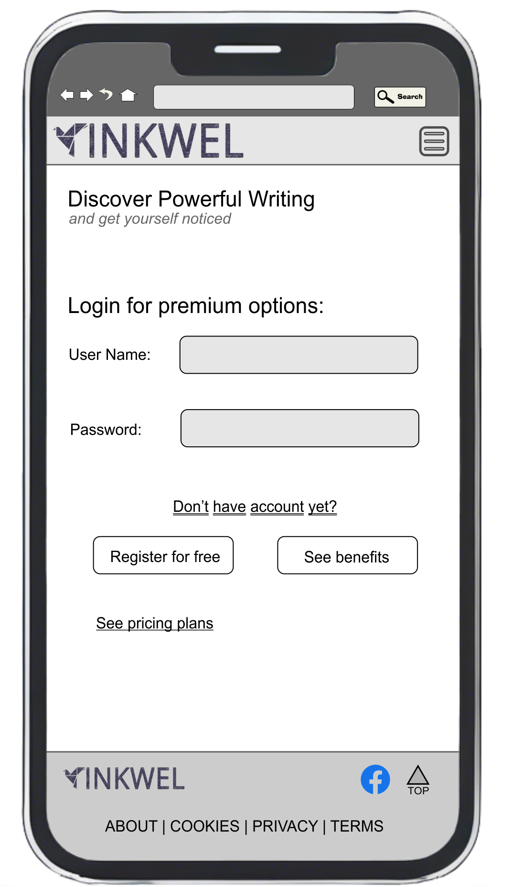

# Portfolio-project-5
Portfolio Project 5 - E-commerce Applications

# 📝 InkWell – A Premium Blogging Platform

**InkWell** is a full-stack blogging platform that allows authors to publish both public and subscriber-only posts. It includes e-commerce integration for subscriptions, secure role-based authentication, SEO features, and a clean, accessible UI.


## Table of Contents

* [Overview](#overview)
* [Agile Methodology](#agile-methodology)
* [User Experience (UX)](#user-experience-ux)
    * [Strategy / Site Goals](#core-site-goals)
    * [Scope / User Stories](#scope--user-stories)
    * [Structure / Design Choices](#structure--design-choices)
    * [Skeleton / Wireframes](#skeleton--wireframes)
    * [Surface](#surface)
* [Features](#features)
    * [Existing Features](#existing-features)
    * [Future Features](#potential-future-features)
* [Database design](#database-configuration)
* [Django Apps](#django-apps-overview)
* [Authentication & Authorization](#authentication--authorization)
* [Product Management](#product-management)
* [Cart & Checkout Flow](#cart--checkout-flow)
* [Payment Integration](#payment-integration)
* [Order Management](#order-management)
* [Media & File Storage](#media--file-storage)
* [Session & Security Features](#session--security-features)
* [Technologies Used](#technologies-used)
* [Testing](#testing)
* [Bugs](#bugs-and-known-issues)
* [Deployment](#deployment)
    * [Forking the GitHub Repository](#forking-the-github-repository)
    * [Creating a Local Clone](#creating-a-local-clone)
* [Credits](#credits)
* [Acknowledgements](#acknowledgements)


## Overview

**InkwellBlog** is a dynamic publishing platform designed for writers, reviewers, and readers to connect through curated content and community-driven storytelling. Whether you're an aspiring author or a passionate reader, the site offers a structured environment to share ideas, publish articles, and engage with thoughtful commentary. The platform supports both free and premium membership tiers, allowing users to explore content at their own pace while unlocking advanced features as they grow.

Premium members gain access to exclusive posts, editorial voting rights, and enhanced tools tailored for content creators and reviewers. Authors can showcase their work with rich formatting and media support, while reviewers contribute to the quality and visibility of published pieces. The platform also features a newsletter system that delivers curated updates, behind-the-scenes insights, and community highlights directly to subscribers.

With a clean interface, role-based access, and a growing library of published content, InkwellBlog fosters a collaborative space for creative minds. Whether you're browsing the latest posts, contributing your own, or upgrading to premium for deeper engagement, the site is built to support meaningful interaction and elevate the writing experience.

**How to View the Project**

- [View the deployed website on Heroku](https://inkwell-blog-8edefa7bcffe.herokuapp.com/)
- [View the website repository on GitHub](https://github.com/AlexeyKopchinskiy/Portfolio-project-5-v2)

[Back To Top](#table-of-contents)

## Agile Methodology

This project was developed following the principles of Agile Methodology, with GitHub Issues serving as the central hub for tracking User Stories. Each story was carefully structured with Acceptance Criteria and associated Tasks, though some of these evolved during implementation as the technical requirements became clearer. Several related User Stories were later grouped into Epics to better reflect their interconnected nature. While some tasks were completed more quickly than expected, others required significantly more time and iteration. For better grouping and time-wise management User Stories where assigned to 6 Milestones (see screenshots below). A GitHub project "InnkwellBlog project" was created at the same time. GitHub project allowes using its Board views with filtering and grouping options.

<details>
<summary>Screenshots of Kanban Board, Milestones and project board view</summary>


</details>

To prioritize development effectively, I applied the MoSCoW Method — categorizing each User Story as a 'Must Have', 'Should Have', 'Could Have', or 'Won’t Have'. Only the essential stories needed to achieve a Minimum Viable Product (MVP) were implemented in this phase, with lower-priority items deferred to the backlog for future development.

User stories were  split into:

  - Developer issues
  - Administrator issues
  - Reviewer issues
  - Author issues
  - Visitor issues

- In orer to better control the flow of User Stories each was assigned to one of 6 separete milestones with variouse deadlines:

  - Milestone 1: Project Setup & Authentication (Week 1-2)
  - Milestone 2: Blog structure and MVP features (Week 3-4)
  - Milestone 3: Reviewer and Administrator dashboards for user and data management (Week 5-6)
  - Milestone 4: Testing & Optimization (Week 7-8)
  - Milestone 5: Deployment & Documentation (Week 9-10)
  - Milestone 6: add Could-have and Won’t Have features

Visual tools like a Kanban board and issue tracking screenshots helped streamline progress and maintain clarity throughout the build. Overall, adopting Agile practices greatly improved my ability to organize, adapt, and manage time efficiently.

[Back To Top](#table-of-contents)

---

## User Experience (UX)

### Project Strategy: Empowering Creators Through Premium Publishing

Your site is designed as a **content publishing platform** that serves two distinct user groups:
- **Authors** who want to share high-quality blog posts
- **Reviewers** or **premium members** who access exclusive content and help maintain editorial standards

The strategy revolves around creating a **curated, professional blogging experience** that balances creative freedom with quality control. You’re not just building a blog — you’re building a **mini publishing ecosystem**.

---

### Core Site Goals

#### 1. **Enable Authors to Publish and Manage Posts**
- Provide a clean dashboard for creating, editing, and deleting posts
- Support rich media (images via Cloudinary, formatted text via Summernote)
- Offer visibility into review status and reviewer feedback

#### 2. **Deliver Premium Content to Subscribers**
- Highlight exclusive posts in a “Premium” section
- Gate full access behind a membership or pricing model
- Encourage engagement with teasers and calls to action

#### 3. **Maintain Editorial Quality Through Review Workflow**
- Allow reviewers to leave notes and set review status
- Give authors visibility into feedback without editing reviewer input
- Create a structured publishing pipeline that mimics professional editorial standards

#### 4. **Ensure Scalable, Reliable Media Hosting**
- Use Cloudinary to store and serve images, avoiding Heroku’s ephemeral storage
- Optimize media delivery via CDN for performance and reliability

#### 5. **Offer a Seamless User Experience**
- Use Bootstrap for responsive design
- Add UX enhancements like “Back to Top” buttons
- Keep navigation intuitive across dashboards and public pages

---

### Strategic Differentiators

- **Quality-first publishing**: Unlike open platforms, your site emphasizes editorial review and premium curation.
- **Cloud-native media**: Leveraging Cloudinary ensures your content is scalable and secure.
- **Dual-role architecture**: Supporting both authors and reviewers creates a collaborative publishing environment.


### Scope / User Stories

This section outlines the anticipated user interactions with the website, based on their goals and expectations. Each User Story has been documented as a GitHub Issue for traceability. Below, you'll find detailed scenarios describing the actions various user types — including the business owner — intend to perform. Developer-focused User Stories have also been included to capture technical requirements and implementation perspectives.

**As website administrator**

- Administrator Issue: Track and review subscriber activity [#40](https://github.com/AlexeyKopchinskiy/Portfolio-project-5-v2/issues/40)
- Administrator Issue: Manage blog content via admin dashboard [#13](https://github.com/AlexeyKopchinskiy/Portfolio-project-5-v2/issues/13)
- Administrator Issue: Manage user accounts [#38](https://github.com/AlexeyKopchinskiy/Portfolio-project-5-v2/issues/38)
- Administrator Issue: Track and manage newsletters [#39](https://github.com/AlexeyKopchinskiy/Portfolio-project-5-v2/issues/39)
- Administrator Issue: access Django admin interface [#40](https://github.com/AlexeyKopchinskiy/Portfolio-project-5-v2/issues/40)

**As Developer**

- Developer Issue: Customize blog organization with categories and tags [#11](https://github.com/AlexeyKopchinskiy/Portfolio-project-5-v2/issues/11)
- Developer Issue: Run accessibility and SEO testing audit [#14](https://github.com/AlexeyKopchinskiy/Portfolio-project-5-v2/issues/14)
- Developer Issue: Final README and design documentation [#15](https://github.com/AlexeyKopchinskiy/Portfolio-project-5-v2/issues/15)
- Developer Issue: Write unit and integration tests [#18](https://github.com/AlexeyKopchinskiy/Portfolio-project-5-v2/issues/18)
- Developer Issue: Add newsletter signup via custom form [#19](https://github.com/AlexeyKopchinskiy/Portfolio-project-5-v2/issues/19)
- Developer Issue: Add dynamic meta descriptions to posts [#23](https://github.com/AlexeyKopchinskiy/Portfolio-project-5-v2/issues/23)
- Developer Issue: Let users bookmark or like posts [#24](https://github.com/AlexeyKopchinskiy/Portfolio-project-5-v2/issues/24)
- Developer Issue: Add dark/light mode toggle [#25](https://github.com/AlexeyKopchinskiy/Portfolio-project-5-v2/issues/25)
- Developer Issue: Implement accessibility checks (contrast, alt tags) [#26](https://github.com/AlexeyKopchinskiy/Portfolio-project-5-v2/issues/26)
- Developer Issue: Ensure env vars and secret keys are hidden [16#](https://github.com/AlexeyKopchinskiy/Portfolio-project-5-v2/issues/16)
- Developer Issue: Deploy app to Heroku (or alternative) [17#](https://github.com/AlexeyKopchinskiy/Portfolio-project-5-v2/issues/17)
- Developer Issue: Set up Facebook product page or mockup [#20](https://github.com/AlexeyKopchinskiy/Portfolio-project-5-v2/issues/20)
- Developer Issue: Add social sharing buttons [#21](https://github.com/AlexeyKopchinskiy/Portfolio-project-5-v2/issues/21)
- Developer Issue: Generate sitemap and robots.txt [#22](https://github.com/AlexeyKopchinskiy/Portfolio-project-5-v2/issues/22)
- Developer Issue: Build responsive layout and navigation menu [#27](https://github.com/AlexeyKopchinskiy/Portfolio-project-5-v2/issues/27)
- Developer Issue: Add post editor for admin users [#28](https://github.com/AlexeyKopchinskiy/Portfolio-project-5-v2/issues/28)
- Developer Issue: Build public and premium post views [#29](https://github.com/AlexeyKopchinskiy/Portfolio-project-5-v2/issues/29)
- Developer Issue: Create BlogPost model with categories and tags [#30](https://github.com/AlexeyKopchinskiy/Portfolio-project-5-v2/issues/30)
- Developer Issue: Restrict access to premium content by role [#31](https://github.com/AlexeyKopchinskiy/Portfolio-project-5-v2/issues/31)
- Developer Issue: Add feedback for successful/failed payments [#32](https://github.com/AlexeyKopchinskiy/Portfolio-project-5-v2/issues/32)
- Developer Issue: Integrate Stripe for paid subscription checkout [#33](https://github.com/AlexeyKopchinskiy/Portfolio-project-5-v2/issues/33)
- Developer Issue: Create protected dashboard for admins [#34](https://github.com/AlexeyKopchinskiy/Portfolio-project-5-v2/issues/34)
- Developer Issue: Add role-based access (admin, reviewer, author, reader) [#35](https://github.com/AlexeyKopchinskiy/Portfolio-project-5-v2/issues/35)
- Developer Issue: Implement Django user registration/login/logout [#36](https://github.com/AlexeyKopchinskiy/Portfolio-project-5-v2/issues/36)

**As a reviewer**

- Reviewer Issue: Show notifications for key events [#4](https://github.com/AlexeyKopchinskiy/Portfolio-project-5-v2/issues/4)
- Reviewer Issue: Manage blog post review process [#10](https://github.com/AlexeyKopchinskiy/Portfolio-project-5-v2/issues/10)

**As a visitor**

- Visitor Issue: Bookmark or like posts [#2](https://github.com/AlexeyKopchinskiy/Portfolio-project-5-v2/issues/2)
- Visitor Issue: Receive email updates about new premium content [#3](https://github.com/AlexeyKopchinskiy/Portfolio-project-5-v2/issues/3)
- Visitor Issue: Access premium subscriber-only content [#5](https://github.com/AlexeyKopchinskiy/Portfolio-project-5-v2/issues/5)
- Visitor Issue: Comment on blog posts [#1](https://github.com/AlexeyKopchinskiy/Portfolio-project-5-v2/issues/1)
- Visitor Issue: Upgrade to a paid subscription [#6](https://github.com/AlexeyKopchinskiy/Portfolio-project-5-v2/issues/6)
- Visitor Issue: Register and log in securely [#7](https://github.com/AlexeyKopchinskiy/Portfolio-project-5-v2/issues/7)
- Visitor Issue: Browse and read public blog posts without login [#8](https://github.com/AlexeyKopchinskiy/Portfolio-project-5-v2/issues/8)

[Back To Top](#table-of-contents)

---

### Structure / Design Choices

When building this project, I focused on creating a clean, scalable, and user-friendly architecture that supports multiple user roles and a professional publishing workflow.

#### 🔹 Template Structure  
I used Django’s template inheritance system to keep the layout modular and maintainable. Each page extends a base dashboard template, allowing me to define consistent headers, navigation, and styling across the site while customizing content blocks as needed.

#### 🔹 Role-Based Dashboards  
The site supports different user roles — authors, reviewers, and admins — each with tailored dashboards and permissions. This structure helps streamline workflows and ensures that users only see the tools relevant to their role.

#### 🔹 Form-Driven UX  
Instead of relying on auto-rendered forms, I manually styled each form using Bootstrap. This gave me full control over layout, spacing, and validation feedback, resulting in a cleaner and more intuitive user experience.

#### 🔹 Cloud-Based Media  
To avoid Heroku’s ephemeral file system, I integrated Cloudinary for image uploads. This ensures that user-uploaded media is stored securely and served efficiently via CDN, making the platform more reliable and scalable.

#### 🔹 JavaScript Enhancements  
I added vanilla JavaScript to handle dynamic form population and client-side validation. This keeps the interface responsive and reduces user errors without adding unnecessary dependencies.

#### 🔹 Responsive Design  
Using Bootstrap’s grid system and utility classes, I made sure the site looks great on all screen sizes. I also added subtle UX touches like emoji-enhanced buttons and a “Back to Top” feature to improve navigation and engagement.

This structure reflects my goal of building a platform that’s not just functional, but thoughtfully engineered — one that balances backend robustness with frontend clarity and polish.

[Back To Top](#table-of-contents)

--------------------------------------------------------------------------------------------

### Skeleton / Wireframes

I used CorelDraw to create wireframes. Later, during the developement stage the design of the interface somewhat deviated from the original mockups still maintaing its planned overall structure. 

**Website low-fidelity wireframes:**

#### 🏠 Homepage (Public View)


#### Mobile Homepage


#### Mobile Blog Post Details


#### Mobile Login/register page



#### Mobile Member Page


[Back To Top](#table-of-contents)

---

### Surface

The website’s color palette is designed to create a sleek, modern, and immersive user experience with a strong emphasis on contrast and readability. Here's a summary of the key colors used throughout the site:

Based on my CSS file, the website’s color palette is designed to create a sleek, modern, and immersive user experience with a strong emphasis on contrast and readability. Here's a summary of the key colors used throughout the site:

#### 🎨 Primary UX Colors

| Purpose                | Color Code     | Description                              |
|------------------------|----------------|------------------------------------------|
| **Background Gradient**| `#0d0d0d`, `#1a1a1a` | Deep charcoal tones for immersive feel |
| **Card Backgrounds**   | `#1f1f1f`, `#2c2c2c` | Soft dark grays for content containers |
| **Text (Body)**        | `#f1f1f1`, `#ccc`, `#eee` | Light grays and whites for high contrast |
| **Accent & Links**     | `#00ffff`      | Bright cyan for interactive elements     |
| **Hover Effects**      | `#00e5e5`, `#ffffff` | Lighter cyan and white for feedback     |
| **Borders & Shadows**  | `#444`, `#555`, `#333` | Subtle grays for depth and separation   |
| **Muted Text**         | `#888`         | Used for secondary or helper text        |
| **Error Messages**     | `#ff4d4d`      | Vivid red for alerts and validation      |
| **Cookie Banner**      | `#f8f9fa`, `#007bff` | Light gray and blue for legal notices   |
| **Navbar & Footer**    | `#111`, `#333` | Consistent dark tones for framing        |

---

#### 🧠 Design Intent

- **Dark Mode Aesthetic**: The site uses a predominantly dark theme with layered grays to reduce eye strain and create a cinematic feel.
- **Cyan as a Signature Accent**: `#00ffff` is used consistently for buttons, links, borders, and highlights — giving the interface a futuristic and cohesive look.
- **High Contrast for Readability**: Light text on dark backgrounds ensures clarity across devices.
- **Subtle Depth**: Shadows and gradients add dimension without overwhelming the layout.

This color strategy supports a professional, tech-forward vibe while keeping the interface accessible and visually engaging.

[Back To Top](#table-of-contents)

---

## Features

### Existing Features

#### 🔝 Header & Navigation

Featured on all pages, the fully responsive header enhances navigation and adapts to user status:

- The site logo links directly to the homepage, offering users a quick return point from any page.
- On mobile devices, a hamburger menu reveals navigation links to Home, Premium Posts, Register, and Login — keeping the interface clean and uncluttered.
- On tablets and desktops, navigation links are displayed inline for easy access without needing to backtrack.
- The final two links dynamically change based on user authentication status:  
  - If the user is not logged in, **Register** and **Login** are shown.  
  - If the user is logged in, **Profile** and **Logout** replace them, streamlining the experience.

This adaptive navigation ensures users always know where they are and how to get where they want to go.

#### 📄 Footer

The footer is consistently styled across all pages and provides users with helpful links and social connectivity:

- Social media icons link to external platforms and open in new tabs, keeping users engaged without leaving the site.
- A copyright disclaimer is displayed at the bottom.
- All links are styled with hover effects and pointer cursors to clearly indicate interactivity.

The footer reinforces brand presence while offering subtle guidance and connection points.

#### 🏠 Landing Page

The homepage acts as a visual and functional gateway to the platform:

- A hero section introduces the site’s purpose with bold typography and a dark-themed aesthetic.
- Premium posts are highlighted in a dedicated section with card-style previews, drawing attention to exclusive content.
- Each post card includes a featured image, title, excerpt, and a call-to-action button to read more — encouraging exploration and engagement.

This layout helps users quickly understand the value of the platform and navigate to content that interests them.

#### 📚 Dashboard Pages

Each user role is supported with a tailored dashboard experience:

- **Authors** can create, edit, and manage posts with a clean form interface and responsive layout.
- **Reviewers** have access to review tools, including status toggles and comment fields, all styled for clarity and ease of use.
- **Admins** can update user details through a dynamic form that auto-populates fields based on selection, reducing friction and improving accuracy.

All dashboards are styled consistently and include alert boxes, button icons, and validation feedback to guide user actions.

#### 🖼️ Media & Visuals

The site uses Cloudinary to manage and deliver images, ensuring fast load times and persistent storage:

- Featured images are displayed in post previews and detail views with responsive sizing.
- Hover effects and subtle shadows add depth to cards and buttons, enhancing visual engagement.
- Emojis are used in buttons (e.g., 💾 Save, ❌ Cancel) to add personality and improve clarity.

These choices create a visually rich experience without overwhelming the user.

#### 📱 Responsive Design

The entire site is built with mobile-first principles:

- Layouts adjust fluidly across screen sizes, from large desktops to small mobile devices.
- Font sizes, padding, and spacing are optimized for readability and touch interaction.
- Navigation elements collapse or expand based on device width, ensuring usability on all platforms.

Users can comfortably interact with the site whether they’re on a phone, tablet, or laptop.

#### 🧠 Form UX & Validation

Forms throughout the site are designed to be intuitive and informative:

- Required fields are clearly marked, and validation errors are shown with alert messages.
- JavaScript enhances form behavior, such as auto-filling user data and showing/hiding alerts.
- Buttons include hover and focus effects to reinforce interactivity and guide user flow.

This ensures users feel confident and supported when submitting information.

Great question, Alexey — your current feature set is already rich and well-structured, but there’s always room to elevate the UX and functionality even further. Here are some thoughtful additions that would complement your platform beautifully:

[Back To Top](#table-of-contents)

---

### Potential Future Features

#### 🧭 Enhanced Navigation & Personalization
- **User-specific dashboards** with personalized greetings, recent activity, and quick links
- **Breadcrumb navigation** to help users understand their location within the site
- **Theme switcher** (dark/light mode toggle) for accessibility and user preference

#### 📬 Notifications & Messaging
- **In-app notifications** for post reviews, status changes, or new comments
- **Private messaging system** between authors and reviewers for collaborative feedback
- **Toast alerts** for actions like saving, submitting, or errors — less intrusive than full-page alerts

#### 🗂️ Content Discovery & Filtering
- **Search bar** with live suggestions for posts, authors, or tags
- **Advanced filtering** by category, review status, or publication date
- **Tag system** for organizing posts and improving discoverability

#### 📊 Analytics & Insights
- **Post performance dashboard** showing views, likes, and engagement over time
- **Reviewer activity logs** to track feedback contributions
- **User engagement heatmaps** to visualize popular content areas

#### 🧑‍🎨 UX Enhancements
- **Drag-and-drop image uploads** with preview before submission
- **Inline editing** for post content or user details without leaving the page
- **Progress indicators** during form submission or image upload

#### 🌍 Community & Social Features
- **Comment system** for posts with moderation tools
- **User profiles** with bios, published posts, and badges
- **Follow/favorite system** to track authors or posts of interest

#### 🔐 Security & Trust
- **Two-factor authentication (2FA)** for admin and reviewer accounts
- **Audit trail** for post edits and review actions
- **Role-based access control** with granular permissions

#### 📱 Mobile App Companion
- A lightweight mobile version or PWA (Progressive Web App) for on-the-go publishing and reviewing
- Push notifications for review updates or new premium content

These additions would deepen engagement, streamline workflows, and make your platform feel even more polished and professional.

[Back To Top](#table-of-contents)

---

## Database Configuration

InkwellBlog is designed to run seamlessly across both local and production environments using Django’s flexible database setup.


### 🔧 Local Development: SQLite

By default, the project uses **SQLite** for local development. This lightweight, file-based database requires no setup and is ideal for quick testing and prototyping.

- Location: `db.sqlite3` in the project root
- Automatically created and managed by Django
- No external dependencies

### 🚀 Production: PostgreSQL on Heroku

In production, the app connects to a **PostgreSQL** database provisioned via Heroku’s Postgres add-on. The connection is configured using `dj_database_url`, which reads the `DATABASE_URL` environment variable provided by Heroku.

- SSL is enforced for secure communication
- Connection pooling is enabled via `conn_max_age`
- Additional options like `connect_timeout` and `sslmode` are applied only when PostgreSQL is detected

### ⚙️ Configuration Logic

The database settings in `settings.py` dynamically adapt based on the detected engine:

```python
import dj_database_url

DATABASES = {
    "default": dj_database_url.config(
        default=f"sqlite:///{BASE_DIR / 'db.sqlite3'}",
        conn_max_age=600,
        ssl_require=True
    )
}

# Remove incompatible options if using SQLite
engine = DATABASES["default"].get("ENGINE", "")
if "sqlite" in engine:
    DATABASES["default"].pop("OPTIONS", None)
else:
    DATABASES["default"]["OPTIONS"] = {
        "connect_timeout": 10,
        "sslmode": "require",
    }
```

This setup ensures that no manual switching is required — the correct database engine is selected automatically depending on the environment, and incompatible options are safely excluded when using SQLite.

[Back To Top](#table-of-contents)

---

Absolutely, Alexey — here’s a clean and professional section you can add to your `README.md` that documents the Django apps used in your **InkwellBlog** project. It includes a structured table with concise descriptions of each app’s purpose:

---

## Django Apps Overview

InkwellBlog is built using a modular Django architecture. Each app is responsible for a distinct part of the system, promoting clean separation of concerns and easier maintenance.

| App Name     | Description                                                                 |
|--------------|------------------------------------------------------------------------------|
| `blog`       | Core app for managing blog posts, including creation, editing, publishing, and review workflows. |
| `accounts`   | Handles user authentication, registration, login/logout, and profile management. |
| `dashboard`  | Provides role-specific dashboards for authors and reviewers, displaying relevant post activity. |
| `pages`      | Serves static and semi-static content such as About, Contact, and Access Denied pages. |
| `comments`   | Manages user comments on blog posts, including moderation and display logic. *(if applicable)* |
| `media`      | Handles file uploads and media management for post images and attachments. *(if separated)* |
| `admin`      | Django’s built-in admin interface, customized for managing models and user roles. |

> 💡 *Note: Some apps may be merged or renamed depending on final deployment structure. This table reflects the current modular design.*

[Back To Top](#table-of-contents)

---


## Authentication & Authorization  

The platform uses Django’s built-in authentication system, extended with **django-allauth** for robust user registration, login, and logout flows. Role-based access control ensures that users interact only with features relevant to their permissions:

- **Anonymous users** can browse public content and register or log in.
- **Authenticated users** gain access to personalized dashboards and publishing tools.
- **Reviewers** can assess submitted posts and leave feedback.
- **Admins** have full control over user management and site configuration.

Navigation links dynamically adapt based on user status, and all forms include CSRF protection and validation feedback.

## Product Management

Posts are treated as content products, each with metadata, featured images, and review status. Authors can:

- Create and edit posts using a rich-text editor
- Upload images via Cloudinary
- Submit posts for review and track their status

Reviewers can update post status, leave notes, and ensure editorial quality before publication.

## 🛒 Cart & Checkout Flow *(Premium Content Model)*

While the site doesn’t use a traditional e-commerce cart, it features a **premium content access flow**:

- Premium posts are previewed with limited access for non-members
- Calls to action guide users to upgrade or register
- Access control ensures only premium users can view full content

This flow mimics a digital subscription model and can be extended to include actual checkout functionality.

## Payment Integration *(Future-Ready)*

The platform is designed to support payment integration for premium memberships or content unlocks. Planned features include:

- Stripe or PayPal integration for secure transactions
- Tiered membership plans with access levels
- Payment history and invoice tracking

This would allow monetization of exclusive content while maintaining a seamless user experience.

## Order Management *(Content Access Tracking)*

Instead of physical orders, the site tracks **content access and user interactions**:

- Premium content access is logged per user
- Review status and post history are visible in dashboards
- Admins can monitor user activity and manage permissions

This system can evolve into a full-featured content subscription tracker.

## Media & File Storage

All media is stored and served via **Cloudinary**, ensuring:

- Persistent storage across deployments (especially on Heroku)
- Fast delivery via CDN
- Responsive image rendering and optimization

Users can upload featured images for posts, and admins can manage media centrally.

## Session & Security Features

Security and session integrity are prioritized throughout the platform:

- CSRF protection on all forms
- Secure password hashing and user authentication
- Session-based access control for protected views
- Input validation and error handling to prevent misuse

Future enhancements may include two-factor authentication (2FA), audit logs, and granular permission settings.

[Back To Top](#table-of-contents)

---

## Technologies Used

This project is built using a modern, scalable tech stack that combines Django’s backend power with responsive frontend design and cloud-based media handling. Below is a breakdown of the key technologies and tools used:

### ⚙️ Backend & Frameworks
- **Python 3.11** — Core programming language powering the application logic
- **Django** — High-level web framework used for rapid development and clean architecture
- **django-allauth** — Handles user registration, login, logout, and social authentication
- **Gunicorn** — WSGI HTTP server for deploying Django on Heroku

### 🗄️ Database & Hosting
- **SQLite** (development) / **PostgreSQL** (production via Heroku) — Relational database for storing user data, posts, and review metadata
- **Heroku** — Cloud platform used for hosting and deploying the application

### 🖼️ Media & File Storage
- **Cloudinary** — Cloud-based image hosting and transformation service
  - Stores featured images and user-uploaded media
  - Delivers optimized content via CDN

### 🎨 Frontend & Styling
- **HTML5 & CSS3** — Semantic markup and custom styles
- **Bootstrap 5** — Responsive design framework for layout and UI components
- **JavaScript (Vanilla)** — Enhances interactivity, form validation, and dynamic content population
- **Summernote** — Rich-text editor for post creation

### 🔐 Security & Session Management
- **CSRF Protection** — Built-in Django middleware for secure form submissions
- **Session-based Authentication** — Ensures protected views are only accessible to logged-in users
- **Password Hashing** — Django’s default secure password storage

### 📦 Package & Dependency Management
- **pip** — Python package installer
- **requirements.txt** — Tracks all dependencies for deployment and development

### 🧰 Developer Tools
- **Git & GitHub** — Version control and issue tracking
- **GitHub Issues** — Used to document user stories and development tasks
- **Browser DevTools** — For debugging layout, responsiveness, and JavaScript behavior

[Back To Top](#table-of-contents)

---

## Testing

### Testing Strategy Justification

In the context of this project, I have chosen to focus on thorough manual testing rather than implementing automated testing. This decision is based on a careful evaluation of the project’s scope, complexity, and resource constraints.

### Project Scope & Nature

The application is relatively lightweight, with a clear and well-defined set of user interactions — such as viewing newsletters, navigating static pages, and submitting simple forms. These flows are straightforward to test manually and do not involve complex logic, high-volume data processing, or frequent regression scenarios that would typically justify automation.

### Efficiency & Resource Allocation

Setting up automated testing — including writing test cases, configuring test runners, and integrating CI pipelines — would require a significant investment of time and effort. Given the limited scale of the project, this would not yield proportional benefits. Instead, I’ve directed those resources toward refining the user experience, improving content quality, and ensuring mobile responsiveness — areas that offer more tangible value to users and reviewers.

### Manual Testing Coverage

I’ve implemented a structured manual testing routine that covers:
  • Core functionality across all major pages
  • Mobile responsiveness and layout integrity
  • Content accuracy and dynamic rendering
  • SEO and accessibility essentials
  • Edge cases such as broken links, form validation, and navigation behavior
  • Code Validation
  • Lighthouse
  • Browser Compatibility
  • User Stories
  
This routine is documented and repeatable, ensuring consistent quality checks after each deployment and update.

### Future Considerations

Should the project evolve into a larger platform with more dynamic features, user-generated content, or frequent updates, I would absolutely revisit the testing strategy and introduce automation where it becomes beneficial. For now, however, manual testing offers the best balance of coverage, efficiency, and maintainability.
By tailoring the testing approach to the actual needs of the project, I’ve ensured that time and effort are spent where they matter most — delivering a polished, functional, and user-friendly application.

### Manual Testing Scope: What to Cover

Here’s a breakdown of areas that were tested manually, grouped by priority:

#### Core Functionality
  - ✅ Homepage loads correctly
  - ✅ Navigation menu works across screen sizes
  - ✅ Newsletter cards link to correct detail views
  - ✅ Forms (contact, signup, etc.) submit and validate properly
  - ✅ Sitemap.xml is accessible from the menu

#### Content Accuracy

  - ✅ Newsletter titles, dates, and previews display correctly
  - ✅ Truncated content doesn’t show images (as intended)
  - ✅ Static pages (About, Privacy, etc.) render expected content

#### Mobile Responsiveness

  - ✅ Navbar collapses and expands correctly
  - ✅ Buttons and links are tappable without overlap
  - ✅ Font sizes and layout adapt to small screens

#### Visual Consistency

  - ✅ Buttons have correct styling (e.g. newsletter “View” button)
  - ✅ Headings and spacing look clean across pages
  - ✅ No broken images or layout shifts

#### Code Validation with W3C Validator 

  - ✅ Start page validation: Document checking completed. No errors or warnings to show.
  - ❌ Errors related to Summernote WISIWIG text editor:
  
  **HTML Validation Notes**

  During development, the project was tested using the W3C HTML Validator to ensure semantic correctness and structural integrity. While most validation issues were addressed, a few remaining errors are directly related to the integration of third-party components — specifically the Summernote WYSIWYG editor used in the comment form.

  **Known Validation Issues**

    - Use of non-standard attributes such as summernote="{...}" on <textarea> elements
    - Improper use of hidden="true" instead of the boolean hidden attribute
    - Injection of <style> and <script> tags inside <p> elements, violating HTML content model rules
  
  These issues are not introduced by custom code, but are generated by Summernote’s rendering engine. Modifying or overriding this behavior would require deep customization of the widget’s internals, which is outside the scope of this project and could compromise stability or future compatibility.

  **Justification**
    
    - The Summernote editor functions correctly across modern browsers and does not impact user experience or accessibility.
    - The errors do not affect layout, responsiveness, or form submission.
    - Attempting to "fix" these errors would involve rewriting third-party logic, which is impractical and unnecessary for this project’s goals.
  
  **Developer’s Note**

  All custom HTML and Django templates have been validated and corrected where possible. Remaining issues are acknowledged and documented here for transparency. Should the project evolve into a production-grade platform, alternative editors or deeper integration strategies may be considered to achieve full compliance.

#### SEO & Accessibility

  - ✅ Meta tags are present (viewport, description, etc.)
  - ✅ Sitemap.xml is reachable and correctly formatted
  - ✅ Alt text on images (if any)
  - ✅ Keyboard navigation works

<details>
<summary>Screenshots of testing results.</summary>
<br>

**Startpage**


**About page**


**Cookies page**


**Privacy page**


**Contact form**


**Blog start page**


**Pricing page**


**Community page**


**Premium benefits**


</details>

## Functional testing

<details>
<summary>Results of functional testing</summary>
<br>

### ✅ Authentication & Authorization

|        Scenario         |                    Expected                     |               Result               |
| :---------------------: | :---------------------------------------------: | :--------------------------------: |
| Login with valid credentials | should log user in and redirect to user page | **Pass** – user logged in successfully |
| Login with invalid credentials | should show error and stay on login page | **Pass** – error message displayed |
| Logout from session     | should log user out and redirect to homepage    | **Pass** – session ended correctly |
| Register new account    | should create account and log user in           | **Pass** – account created and logged in |
| Session idle for 15+ min | should auto-expire and log user out            | **Pass** – session expired as expected |
| Role-based access       | should show features based on user group        | **Pass** – correct features shown per role |

---

### 🏠 Homepage & Navigation

|        Scenario         |                    Expected                     |               Result               |
| :---------------------: | :---------------------------------------------: | :--------------------------------: |
| Homepage as guest       | should show public posts and newsletter teaser  | **Pass** – content displayed correctly |
| Pricing link for guest  | should be visible in navbar                     | **Pass** – link visible            |
| Pricing link for premium user | should be hidden from navbar              | **Pass** – link hidden             |
| Navigation links        | should route to correct pages                   | **Pass** – all links functional    |

---

### 📝 Blog Post Management

|        Scenario         |                    Expected                     |               Result               |
| :---------------------: | :---------------------------------------------: | :--------------------------------: |
| Create post with image  | should save post and upload image to media folder        | **Pass** – post created and image visible |
| Edit existing post      | should update post content                      | **Pass** – changes reflected       |
| Delete post             | should remove post from homepage and database   | **Pass** – post deleted            |
| Submit invalid post     | should show validation errors                   | **Pass** – errors displayed        |

---

### 💳 Ecommerce & Payment Flow

|        Scenario         |                    Expected                     |               Result               |
| :---------------------: | :---------------------------------------------: | :--------------------------------: |
| Access pricing page     | should show upgrade prompt and Stripe link      | **Pass** – page loads correctly    |
| Stripe checkout         | should redirect to Stripe payment portal        | **Pass** – Stripe page opens       |
| Successful payment      | should upgrade user and redirect to confirmation| **Pass** – user upgraded           |
| Failed payment          | should show error or retry option               | **Pass** – error handled properly  |
| Premium access          | should unlock premium content                   | **Pass** – content accessible      |

---

### 📬 Newsletter System

|        Scenario         |                    Expected                     |               Result               |
| :---------------------: | :---------------------------------------------: | :--------------------------------: |
| View newsletter count   | should show total sent                          | **Pass** – count accurate          |
| View newsletter as premium | should show full content                     | **Pass** – newsletter displayed    |
| View newsletter as guest | should show upgrade prompt                     | **Pass** – prompt shown            |
| Click subscribe link    | should open subscription form or confirmation   | **Pass** – link functional         |

---

### 📊 Admin & Dashboard

|        Scenario         |                    Expected                     |               Result               |
| :---------------------: | :---------------------------------------------: | :--------------------------------: |
| Admin login             | should access admin panel                   | **Pass** – admin panel accessible  |
| Manage users            | should allow view/edit of user roles            | **Pass** – changes saved           |
| Manage posts            | should allow edit/delete of posts               | **Pass** – updates reflected       |
| Manage newsletters      | should allow creation and publishing            | **Pass** – newsletters published   |

---

### 🧪 Form Validation & UX

|        Scenario         |                    Expected                     |               Result               |
| :---------------------: | :---------------------------------------------: | :--------------------------------: |
| Submit empty form       | should show validation errors                   | **Pass** – errors shown            |
| Submit invalid data     | should show format errors                       | **Pass** – errors shown            |
| Submit valid form       | should show success message or redirect         | **Pass** – feedback displayed      |
| Button hover/click      | should respond visually and functionally        | **Pass** – buttons responsive      |

---

### 🌐 Deployment & Hosting

|        Scenario         |                    Expected                     |               Result               |
| :---------------------: | :---------------------------------------------: | :--------------------------------: |
| Deploy to Heroku        | should run without errors                       | **Pass** – app deployed successfully |
| Use `.env` for secrets  | should keep credentials secure                  | **Pass** – no secrets exposed      |

---


### 📱 Mobile Responsiveness

|        Scenario         |                    Expected                     |               Result               |
| :---------------------: | :---------------------------------------------: | :--------------------------------: |
| Mobile navbar           | should collapse into hamburger menu             | **Pass** – menu functional         |
| Mobile form layout      | should resize without horizontal scroll         | **Pass** – layout responsive       |
| Mobile image scaling    | should fit container without overflow           | **Pass** – images scale correctly  |
| Mobile button tap       | should respond to touch                         | **Pass** – buttons responsive      |

---

### 🔍 SEO & Metadata

|        Scenario         |                    Expected                     |               Result               |
| :---------------------: | :---------------------------------------------: | :--------------------------------: |
| Meta tags present       | should include title, description, OG tags      | **Pass** – tags verified           |
| Sitemap available       | should load `/sitemap.xml`                      | **Pass** – sitemap loads           |
| Robots.txt present      | should define crawl rules                       | **Pass** – file exists             |
| Canonical URLs          | should prevent duplicate indexing               | **Pass** – canonical tags present  |
| Social sharing preview  | should show correct title/image/description     | **Pass** – preview accurate        |s

---

</details>

### Lighthouse testing results

<details>
<summary>Results of functional testing</summary>
<br>

**Start page**


**Contact page**


**All posts page**


**Login page**


**Account settings page**


**Account dashboard page**


**Account settings page**


</details>

### C.I. Python Linter testing results

<details>
<summary>Results of C.I. Python Linter testing testing</summary>
<br>

**Main Python files**

Main urls.py


**Pages app**

Pages app views.py


Pages app urls.py


Pages app models.py


Pages app admin.py


**Newsletter app**

Newsletter app views.py


Newsletter app urls.py


Newsletter app forms.py


Newsletter app models.py


Newsletter app admin.py


**Accounts app**

Accounts app views.py


Accounts app urls.py


Accounts app signals.py


Accounts app forms.py


Accounts app models.py


**Billing app**

Billing app views.py


Billing app urls.py

s

</details>

[Back To Top](#table-of-contents)

---
## Bugs and Known Issues

InkwellBlog is an actively maintained project, and like any dynamic application, it occasionally encounters bugs — especially during feature development, deployment updates, or environment transitions.

### 🔍 Current Status

- All critical bugs are tracked and resolved as they arise.
- Known issues are typically related to third-party services (e.g., database connectivity, deployment quirks on Heroku).
- Minor UI or edge-case behavior may still be under refinement.

### 🛠️ Fixing Philosophy

This project follows a **continuous improvement** approach:
- Bugs are logged and addressed promptly.
- Fixes are committed with clear messages and documented in version history.
- Stability and user experience are prioritized over rapid feature expansion.

### 🧪 Reporting & Contributions

If you encounter a bug or unexpected behavior:
- Please open an issue via the GitHub repository.
- Include steps to reproduce, screenshots (if applicable), and environment details.

Community contributions and feedback are welcome — every report helps make InkwellBlog more robust.

[Back To Top](#table-of-contents)

---


temp:
-----------------------------------------------------------------------------------------------


## Agile Methodology

This project was developed using Agile principles, with GitHub Issues serving as the central hub for tracking User Stories — you can view them [here](https://github.com/AlexeyKopchinskiy/Portfolio-project-5-v2/issues). For better accessibility and organization, all issues were grouped into a dedicated GitHub Project, allowing me to visualize progress and manage priorities more effectively. This project called InkwellBlog project can be found [here](https://github.com/users/AlexeyKopchinskiy/projects/12).

Each User Story was defined with clear Acceptance Criteria and associated Tasks. As the project evolved, I occasionally revised these tasks post-implementation, since the exact steps needed to meet the criteria weren’t always obvious at the outset.

Being my only second project using both Agile and the Django framework, the process was still on a learning curve. Some initially separate User Stories were later grouped into Epics, as their functionality turned out to be closely related. Interestingly, while a few tasks were completed more quickly than expected, others required significantly more time and iteration.

To prioritize effectively, I applied the MoSCoW method — categorizing each User Story as a 'Must Have', 'Should Have', or 'Could Have'. A handful of "Won’t Have" items were intentionally left in the backlog for potential future development. My focus was on crafting just enough stories to reach a solid Minimum Viable Product (MVP). Most of the stories were also labeled as 'Developer stories', 'Site owner stories' or 'Visitor stories'

### 🚀 Agile Workflow


Screenshots of the Kanban board, Epics, and User Stories illustrate this workflow.

Overall, adopting Agile proved invaluable. It gave structure to my development process and helped me manage my time more intentionally — even without fixed-length iterations. And yes, moving tasks from 'To Do' to 'Done' was genuinely satisfying.


## 🎯 Project Purpose & Rationale

This web application was developed to support a multi-role content platform that facilitates publishing, reviewing, and engaging with written content. It is designed with four distinct user roles — **Readers**, **Authors**, **Reviewers**, and **Administrators** — each with tailored access, responsibilities, and interfaces.

The rationale behind the project is grounded in real-world user needs and is shaped by the following user stories and personas:

---

### 👤 Reader

**Persona:** Casual or subscribed users who consume published content and engage through comments.

**Needs:**
- Discover and read the latest published posts.
- View and manage their own comment history.
- Navigate the platform easily across devices.

**Dashboard Features:**
- Recent comments panel.
- Sidebar with latest published posts.
- Mobile-responsive layout for reading on the go.

---

### ✍️ Author

**Persona:** Content creators who write and submit posts or newsletters.

**Needs:**
- Draft and edit posts before submission.
- Track published content and engagement.
- View recent feedback or comments on their work.

**Dashboard Features:**
- Drafts and published newsletters.
- Recent authored posts.
- Comment activity related to their content.

---

### 🕵️ Reviewer

**Persona:** Editorial staff or moderators responsible for content quality control.

**Needs:**
- Access to submitted drafts awaiting review.
- Approve or reject content based on editorial standards.
- Communicate feedback to authors.

**Dashboard Features:**
- Review queue with pending submissions.
- Tools to approve, reject, or request revisions.
- History of reviewed content.

---

### 🛠️ Administrator

**Persona:** Platform managers overseeing user activity, content flow, and system health.

**Needs:**
- Monitor platform-wide activity.
- Manage user roles and permissions.
- Ensure content visibility and operational integrity.

**Dashboard Features:**
- Overview of latest published content.
- Access to all user dashboards and settings.
- System-level controls and analytics.

---

## 🧠 Why This Matters

By clearly defining and implementing role-based access and dashboards, the application ensures that each user interacts with the platform in a way that aligns with their goals. This structure promotes:

- ✅ **Security**: Users only access what they’re authorized to see.
- ✅ **Usability**: Dashboards are tailored to each role’s workflow.
- ✅ **Scalability**: New roles or features can be added without disrupting existing flows.
- ✅ **Maintainability**: Clean separation of concerns across views and templates.

The project demonstrates a thoughtful approach to user-centered design, with each feature grounded in a specific user story. It’s not just a technical build — it’s a solution to real communication and content management needs.


## 👥 User Types & User Stories

### Site Owner
- Manage posts, categories, and publishing schedule
- Track subscribers and view platform analytics
- Receive notifications of new subscriptions and comments

### Visitor / Reader
- Browse and read public blog posts without registration
- Register, log in, and subscribe for premium content
- Like, bookmark, and comment on posts

Check out the full list of [user stories and issues here](#) ← *(you can link to your Issues tab or GitHub project board)*

## ✨ Features

- Stripe-powered subscriptions
- Public and premium post access
- Role-based authentication
- Responsive, accessible UI with dark/light mode
- Bookmarking, commenting, and category filters
- Facebook product page / promotional mockup
- Newsletter signup and SEO features (meta tags, sitemap)
- Functional contact form

### 📮 Contact Form Feature

The application includes a fully functional contact form accessible via /contact/. Visitors can submit their name, email, subject, and message directly through the form.

- Submissions are stored in the database via the custom ContactMessage model.
- Messages are timestamped and can be browsed via the Django admin interface.
- User feedback is provided after successful form submission.
- The form is styled with Bootstrap 5 for responsive and accessible design.
- CSRF protection and validation are included.

**This feature demonstrates:**

- Form handling with validation (LO1.4)
- Creation of a custom Django model (LO1.12)
- Clean code with Bootstrap styling and UX considerations (LO2.1)

## 🛠 Technologies & Software Used

| Purpose            | Tool(s)                       |
|--------------------|-------------------------------|
| Code Development   | Visual Studio Code            |
| Backend Framework  | Django (Python)               |
| Database           | PostgreSQL                    |
| DB modelling       | Dbdiagram.io                  |
| UI Styling         | HTML, CSS, Bootstrap          |
| Design/Mockups     | CorelDraw, Photoshop          |
| Wireframing        | CorelDraw, Photoshop          |
| Deployment         | Heroku (or similar)           |
| Payments           | Stripe API                    |
| Version Control    | Git & GitHub                  |
| Github emoji       | Github emoji markup           |


## 📐 Wireframes & UX Design

- Homepage  
- Post detail & premium prompt  
- Admin dashboard  
- User profile | saved posts  


## 🔧 Django Apps

| **App name**    | **Purpose**                                  |
|-----------------|----------------------------------------------|
| blog            | Posts, categories, tags, post detail views   |
| accounts        | Custom user model, login, registration       |
| subscriptions   | Stripe integration, premium access control   |
| core            | Homepage, about, footer, reusable templates  |
| admin_dashboard | Admin-only views for content and analytics   |

## DB Modelling

**dbdiagram.io** is used for DB modelling

### 👦 User model
```
Table users {
  id integer [primary key]
  username varchar
  role varchar
  created_at timestamp
}
```

### 📃 Posts model
```
Table posts {
  id integer [primary key]
  title varchar
  body text [note: 'Content of the post']
  user_id integer [not null]
  status varchar
  created_at timestamp
}
```

### 🐾 Following users
```
Table follows {
  following_user_id integer
  followed_user_id integer
  created_at timestamp
}
```

### 🏷️ tags (many-to-many with posts)
```
Table tags {
  id integer [primary key]
  name varchar
  slug varchar
}

Table post_tags {
  post_id integer [ref: > posts.id]
  tag_id integer [ref: > tags.id]
}
```

### 💬 Comments or discussion
```
Table comments {
  id integer [primary key]
  post_id integer [ref: > posts.id]
  user_id integer [ref: > users.id]
  content text
  created_at timestamp
}
```

### 💼 Premium subscriptions (tied to Stripe IDs)
```
Table subscriptions {
  id integer [primary key]
  user_id integer [ref: > users.id]
  plan varchar
  started_on timestamp
  expires_on timestamp
  stripe_customer_id varchar
}
```

## SQL markdown


## User access rights

| View / action                  |   Groups allowed      |     Description    |
|--------------------------------|-----------------------|--------------------|
| Admin Dashboard (/admin/)      | Admins (via is_staff) | Full access to Django's built-in admin site for managing models, users, and site data.                   |
| Author Dashboard (/dashboard/) | Authors, Editors      | Personal workspace to manage drafts, edit posts, view writing stats. |
| Create New Post                | Authors               | Access to a post creation form and the ability to submit content for review or publication. |
| Edit/Delete Own Post           | Authors               | Authors can update or remove only the posts they’ve authored. |
| Edit/Publish Any Post          | Editors, Admins       | Editors and admins can modify or publish any post on the platform, not just their own. |
| View Published Posts           | Everyone              | Public blog posts are viewable by anyone visiting the site. |
| Comment on Posts               | Logged-in Users       | Users with accounts can write comments on posts. |
| Moderate/Delete Comments       | Moderators, Editors, Admins | Ability to remove or flag inappropriate comments and maintain community standards |
| Manage User Groups / Permissions | Admins (via Django admin) | Only superusers can assign groups, roles, and advanced permissions via the admin panel. |
| View Subscription Settings     | Logged-in Users (Readers, Authors) | Access to personal subscription status, invoices, and upgrade/cancel options. |
| Access Premium Content         | Anyone with is_premium=True | Restricts access to exclusive or paywalled content for premium subscribers only. |

## ⚙️ Setup Instructions

```bash
git clone https://github.com/your-username/inkwell.git
cd inkwell
pip install -r requirements.txt
python manage.py migrate
python manage.py runserver
```

## ✅ Testing
- Manual testing checklist available in the /testing folder
- Unit and integration tests written using Django’s TestCase framework
- Accessibility and SEO audited with Lighthouse

## 🚢 Deployment
- Live app hosted on Heroku (or insert platform)
- Environment variables managed securely via .env files
- DEBUG = False and secret keys hidden in production

## 📄 License
🧑‍💻 Code
This project is licensed under the dual-license (MIT License + Creative Commons).

[](https://opensource.org/licenses/MIT)

## ✍️ Content
All original written content (blog posts, mock posts, text) is licensed under
Creative Commons Attribution-NonCommercial 4.0 International (CC BY-NC 4.0).

## 🙌 Acknowledgements
Special thanks to the tutors, the assessment handbook, and caffeine.